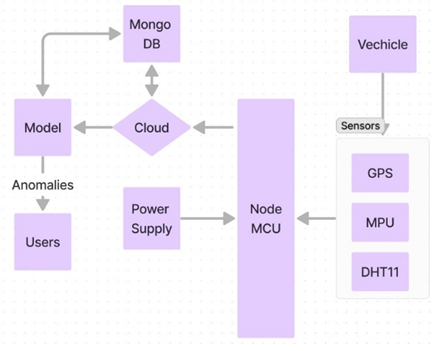
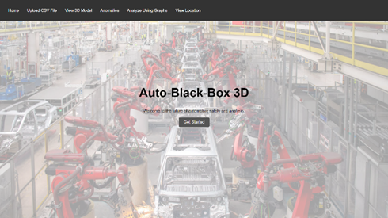
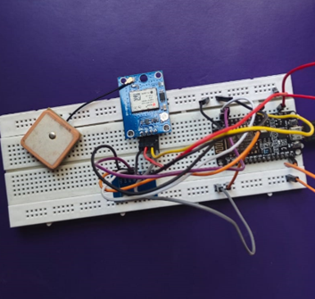
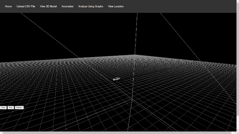
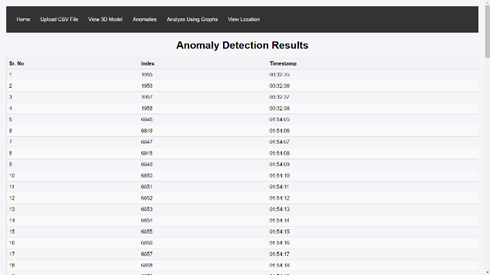
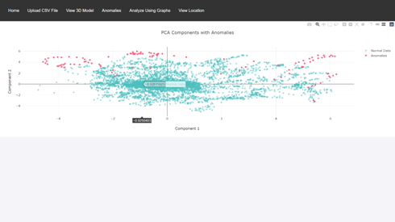
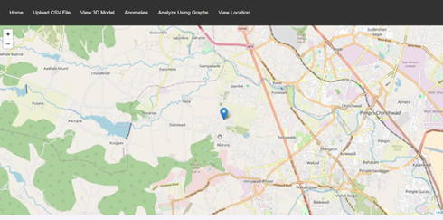

# Auto-BlackBox-3D

## Employing Black Box Mechanism for Investigation and Analysis of Road Accidents

## Overview
This project presents a novel system for accident analysis using advanced sensor technology. The system gathers real-time acceleration, gyroscope, and GPS data to create detailed 3D models of vehicle orientation during accidents. By employing machine learning techniques and data visualization tools, the system enhances post-accident analysis and provides valuable feedback for improving vehicle design and safety.

## Features
- **Data Collection**: Utilizes MPU6050 and GPS sensors to gather acceleration, gyroscope, and location data.
- **Anomaly Detection**: Employs autoencoders to detect anomalies in acceleration values.
- **3D Modeling**: Uses Three.js to create real-time 3D models of vehicle orientation.
- **Data Visualization**: Implements Plotly.js for comprehensive data visualization.
- **Location Tracking**: Integrates OpenStreetMap API for live GPS tracking.

## System Architecture

## Methodology
1. **Data Collection**: Sensors capture acceleration, gyroscope, and GPS data.
2. **Data Processing**: NodeMCU processes and transmits data to the cloud.
3. **3D Modeling**: Three.js visualizes vehicle orientation in 3D.
4. **Anomaly Detection**: Autoencoders identify anomalies in the data.
5. **Data Visualization**: Plotly.js generates graphs for data analysis.

## Results
- **3D Model Rendering**: Real-time visualization of vehicle orientation during accidents.
- **Anomaly Detection**: Identified 581 anomalies with a 94.99% accuracy rate.
- **Data Visualization**: Comprehensive graphs showing acceleration and gyroscope data.

### Homepage of Flask Application

### Hardware Connections

### Viewing 3D Model

### Anomalies

### PCA Projection of Sensor Readings

### Tracking Live Location

